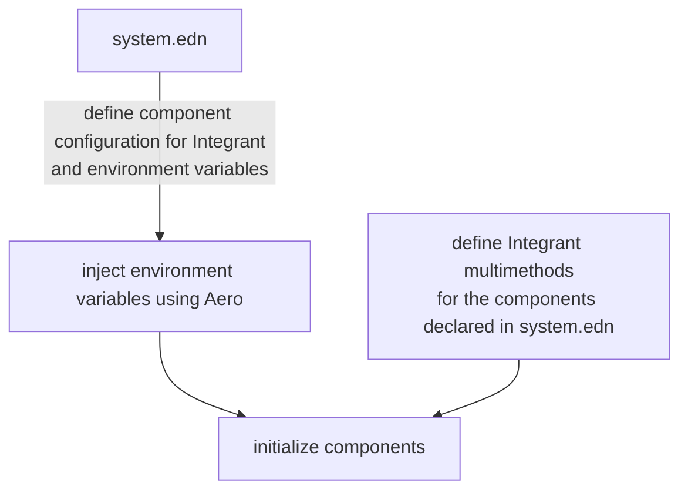

# Kit Workshop

## Table of Contents

- [Kit Workshop](#kit-workshop)
  - [Table of Contents](#table-of-contents)
  - [Prerequisites](#prerequisites)
    - [Setup](#setup)
    - [Intro to Clojure](#intro-to-clojure)
    - [Conduct During the Workshop](#conduct-during-the-workshop)
  - [Kit Workshop](#kit-workshop-1)
    - [SECTION 1](#section-1)
    - [Creating a Project](#creating-a-project)
    - [kit.edn](#kitedn)
    - [Starting the REPL](#starting-the-repl)
    - [Using Modules](#using-modules)
    - [SECTION 2](#section-2)
    - [What are Modules](#what-are-modules)
    - [Adding a Database](#adding-a-database)
    - [SECTION 3](#section-3)
    - [Managing the Database](#managing-the-database)
    - [Querying the Database](#querying-the-database)
    - [SECTION 4](#section-4)
    - [Routing](#routing)
    - [SECTION 5](#section-5)
    - [Adding Dependencies](#adding-dependencies)
    - [Creating Integrant Components](#creating-integrant-components)
      - [Integrant Component Lifecycle](#integrant-component-lifecycle)
      - [Compoent Lifecycle Multimethods](#compoent-lifecycle-multimethods)
      - [Loading Integrant Components](#loading-integrant-components)
      - [Trying Things Out in the REPL](#trying-things-out-in-the-repl)
      - [Wiring Up Our New Component](#wiring-up-our-new-component)
    - [Processing GIF Payload](#processing-gif-payload)
      - [Error Handling](#error-handling)
      - [Swagger API Testing](#swagger-api-testing)
    - [SECTION 6](#section-6)
    - [Testing with the REPL](#testing-with-the-repl)
    - [SECTION 7](#section-7)

## Prerequisites

macOS or Linux recommended.

### Setup

Make sure you have the following dependencies installed:

- Clojure CLI https://clojure.org/guides/install_clojure
- Java 11+ (17 recommended)
- Docker and [docker compose](https://docs.docker.com/compose/gettingstarted/). Check that you can run `docker compose up` on a simple `docker-compose.yml` file. (alternatively make sure you have a locally running Postgres on your machine)
- VSCode with Calva, or editor of preference as long as it's nREPL compatible (Cursive, Emacs, etc.)

Optionally, we recommend installing Babashka to run the frontend script that will be used to test the project
- Babashka https://babashka.org

Clone this repository and make sure you can run the project by doing the following

```bash
git clone git@github.com:yogthos/kit-workshop.git
cd kit-workshop
clj -M:dev:nrepl
```

This should start up a REPL prompt, it might output something like:

```
nREPL server started on port 50354 on host localhost - nrepl://localhost:50354
nREPL 0.9.0
Clojure 1.11.1
OpenJDK 64-Bit Server VM 17.0.1+12-LTS
Interrupt: Control+C
Exit:      Control+D or (exit) or (quit)
```

Inside the prompt, test that you can start the application server by running:

```clojure
(go)
```

Then go to [http://localhost:3000/api/health](http://localhost:3000/api/health) to check that the server is running.

### Intro to Clojure

This workshop assumes a basic familiarity with Clojure and functional programming. If you are new to Clojure, we can recommend the following resources to get started:

- High level overview https://yogthos.github.io/ClojureDistilled.html
- An Animated Introduction to Clojure https://markm208.github.io/cljbook/
- Clojure from the Ground Up https://aphyr.com/tags/Clojure-from-the-ground-up
- Clojure for the Brave and True https://www.braveclojure.com/foreword/

Of course you are also welcome to search around and find other resources suited to your learning style or interests.

We will **not** be going over the basics of Clojure during the workshop.

### SECTION 1

### Conduct During the Workshop

Some general guidelines during the workshop

- By attentding this workshop, you agree to the [Code of Conduct](/CONDUCT.md)
- If you get stuck, questions are encouraged
- There is a checkpoint branch at the end of each section to make sure everyone's on the same page.

## Kit Workshop

### Creating a Project

Kit uses [clj-new](https://github.com/seancorfield/clj-new) to create projects from the template. If you don't already have it installed on your local machine, you can pull it in by running

```bash
clojure -Ttools install com.github.seancorfield/clj-new '{:git/tag "v1.2.381"}' :as new
```

Now we can create our new project by running.

```bash
 clojure -Tnew create :template io.github.kit-clj :name io.github.kit/gif2html
cd gif2html
```

Let's initialize git so that we can reference the checkpoints in the workshop in case we run into trouble along the way.

```bash
git init
git checkout -b workshop
git add .
git commit -a -m "initial commit"
git remote add origin git@github.com:yogthos/kit-workshop.git
git fetch 
```

You should now have a project with the following folders

```
├── env
│   ├── dev/clj/io/github/kit/gif2html
│   │   └── resources
│   ├── prod/clj/io/github/kit/gif2html
│   │   └── resources
│   └── test
│       └── resources
├── resources
├── src/clj/io/github/kit/gif2html/web
│                                  ├── controllers
│                                  ├── middleware
│                                  └── routes
└── test/clj/io/github/kit/gif2html    
```

Let's take a look at what these folders are and their purpose.

* `env` - This folder contains environment dependent code.
  * `dev` - The code in this folder will only be run during development.
  * `prod` - The code in this folder will be compiled into the uberjar when the application is packaged for deployment. 
* `resources` - This folder contains static assets such as configuration files, HTML templates, and so on.
* `src/clj` - This folder contains the application code.
  * `controllers` - This package contains namespaces that handle your application business logic.
  * `middleware` - This package contains Ring routing middleware that encapsulates cross-cutting logic shared across the routes.
  * `routes` - This package is where server endpoints are defined.
* `test` - This folder contains the tests.

### deps.edn

This file contains the dependencies and aliases used to manage our project. We can see that the file has a few libraries listed under dependencies that provide routing, logging, and other useful functionality for our project.

### kit.edn

Kit uses a module system that allows adding new functionality to existing Kit projects by installing modules from the REPL.
This file contains metadata about the project and referenes to module repositories that will be used to add new modules in the project.

Kit modules are templates that get injected in the project and generate code within exisitng project files. The metadata in `kit.edn` is
used to specify the paths and namespaces for the generated code.

### Starting the REPL

The REPL can be started by running the following command from the project folder:

```shell
clj -M:dev:nrepl
```

Once the REPL starts you should see the following in the terminal, note that the PORT is selected at random:

```shell
nREPL server started on port 65110 on host localhost - nrepl://localhost:65110
nREPL 0.9.0
Clojure 1.11.1
OpenJDK 64-Bit Server VM 17.0.1+12-39
Interrupt: Control+C
Exit:      Control+D or (exit) or (quit)
user=>
```

Once you see the prompt, you can connect your editor to the REPL. We'll go through connecting Calva, but other editors should work similarly.

* Click on the `REPL` button at the bottom left.
* Select `Connect to a running REPL in your project`
* Select `deps.edn`
* Press `enter`, correct port should be detected automatically.

If everything went well then you should see the following prompt:

```clojure
; Connecting ...
; Hooking up nREPL sessions...
; Connected session: clj
; TIPS:
;   - You can edit the contents here. Use it as a REPL if you like.
;   - `alt+enter` evaluates the current top level form.
;   - `ctrl+enter` evaluates the current form.
;   - `alt+up` and `alt+down` traverse up and down the REPL command history
;      when the cursor is after the last contents at the prompt
;   - Clojure lines in stack traces are peekable and clickable.
clj꞉user꞉> 
```

### Using Modules

We'll need to pull the modules from the remote repository. This is accomplished by running the following commmand in the REPL:

```clojure
clj꞉user꞉> (kit/sync-modules)
:done
```
If the command ran successfully then you should see a new `modules` folder in the project containing the modules that were downloaded and are now available for use.
Let's list the available modules:

```clojure
clj꞉user꞉> (kit/list-modules)
:kit/html - adds support for HTML templating using Selmer
:kit/htmx - adds support for HTMX using hiccup
:kit/ctmx - adds support for HTMX using CTMX
:kit/metrics - adds support for metrics using prometheus through iapetos
:kit/sente - adds support for Sente websockets to cljs
:kit/sql - adds support for SQL. Available profiles [ :postgres :sqlite ]. Default profile :sqlite
:kit/cljs - adds support for cljs using shadow-cljs
:kit/nrepl - adds support for nREPL
:done
```

Finallly, let's try starting the server to make sure our application is working.

```clojure
clj꞉user꞉> (go)
:initiated
```
Let's navigate to `http://localhost:3000/api/health` and see if we have some health check information returned by the server:

```javascript
{"time":"Fri Feb 10 13:54:36 EST 2023",
 "up-since":"Wed Jan 18 22:53:21 EST 2023",
 "app":{"status":"up","message":""}}
```

### SECTION 2

At this point you should have your project setup, are able to run and connect to the REPL, and run the web server successfully.

[Click here to see the solution to the previous section](https://github.com/yogthos/kit-workshop/tree/checkpoint-1)

### What are Modules

By now we've synced modules, but what are they? Kit modules consist of templates that can be used to inject code and resources into a Kit project.

By default, we have the public Kit modules repository linked under the `:modules` key of your `kit.edn` configuration of your project.

```clojure
{:root         "modules"
 :repositories [{:url  "https://github.com/kit-clj/modules.git"
                 :tag  "master"
                 :name "kit-modules"}]}
```

This configuration says to pull Kit modules template from the repository `https://github.com/kit-clj/modules.git` on the branch `master`.

This means that it is possible to extend this configuration with private or public modules that you write yourself. We won't be covering this during the workshop, but feel free to give it a try afterwards.

Now, let's use Modules to connect to a database.

### Adding a Database

Let's remind ourselves what modules we can install via `(kit/list-modules)`.

You'll notice there is `:kit/sql` module with various **profiles**. Some modules have features that can be chosen from when installing. To use a non-default feature simply specify the feature flag in an options map as a second argument to `kit/install-module`. For example, `{:feature-flag :postgres}`.

Now let's do this to set up PostgreSQL with our project:

```clojure
(kit/install-module :kit/sql {:feature-flag :postgres})
```

You should see something like this in your REPL output

```clojure
clj꞉user꞉> (kit/install-module :kit/sql {:feature-flag :postgres})
:kit/sql requires following modules: nil
applying features to config: [:base]
updating file: resources/system.edn
updating file: deps.edn
updating file: src/clj/io/github/kit/gif2html/core.clj
applying
 action: :append-requires 
 value: ["[kit.edge.db.sql.conman]" "[kit.edge.db.sql.migratus]"]
:kit/sql installed successfully!
restart required!
:done
```

Let's take a look at the change that the module made to the project by looking at the diff:

```shell
git diff
```
Let's quickly add a `docker-compose.yml`. You can copy this over in to the root of the project:

```yml
version: '3.9'

services:
  db:
    image: postgres:15-alpine
    environment:
      POSTGRES_PASSWORD: gif2html
      POSTGRES_USER: gif2html
      POSTGRES_DB: gif2html
    ports:
      - "5432:5432"
    volumes:
      - db_data:/var/lib/postgresql/data

volumes:
  db_data:
```

We can start this up by running

    docker compose up -d

This will start the services defined in our `docker-compose.yml` file in detached mode. For more about docker, you can read up on it [here](https://docs.docker.com/compose/).

Let's take a look at some of the code that was generated by installing the SQL module.

Firstly, let's see the dependencies added to our `deps.edn`.

```
io.github.kit-clj/kit-sql-conman    Conman is a connection pooling library and a utility for setting up HugSQL
io.github.kit-clj/kit-sql-migratus  Migratus is a library for managing DB migrations
org.postgresql/postgresql           This is the JDBC PostgreSQL connector
```

These dependencies were linked in our `src/clj/io/github/kit/gif2html/core.clj` as `requires` in the namespace.

We now also have two new directories in our `resources` folder: `migrations` and `sql`. Under `migrations` you will be able to create `.sql` up and down migrations for Migratus to apply to your database schema. And under `sql` there is an empty `queries.sql` file created. Here we will write [HugSQL](https://www.hugsql.org/) queries.

Our `system.edn` was changed to define the Database we'll be using. Here we have three new integrant components defined:

- `:db.sql/connection`: This is the pooled DB connection to our PostgreSQL database
- `:db.sql/query-fn`: The HugSQL queries defined in your `resources/sql/queries.sql` can be used with this function
- `:db.sql/migrations`: The configuration for Migratus.

Lastly, before we try running our system again, let's change our `:db.sql/connection` connection string in `system.edn`. 

Here we have three different profiles. For sake of simplicity, we can use the same DB connection for `test` and `dev`. 

Let's drop the `:test` and `:dev` profile, and instead use a `:default` profile with the following value.

```clojure
:default {:jdbc-url "jdbc:postgresql://localhost:5432/gif2html?user=gif2html&password=gif2html"}
```

Now let's run

```clojure
(reset)
```

And we should be connected to our database. Let's check that by running

```clojure
(require '[next.jdbc :as jdbc])
(jdbc/execute! 
  (:db.sql/connection state/system)
  ["select column_name from information_schema.columns where table_name = 'schema_migrations';"])
```

It should return the schema of our migrations table generated by Migratus.

Let's add one more dependency in `deps.edn`:

```clojure
io.github.kit-clj/kit-postgres {:mvn/version "1.0.3"}
```
 
 This library contains extensions for JDBC to store data structures such as EDN as JSON in PostgreSQL. We can refer it in `core.clj` by adding `[kit.edge.db.postgres]` to the `requires` vector. Let's restart the REPL to make sure the changes take effect.

Don't worry, these commands will be explained shortly.

Let's take a quick look at what we've added above and why. The new component configurations that we now have in `system.edn` will be used to instantiate the Integrant components defined by the libraries that are provided by Kit.

These libraries are:

* [kit-sql-conman](https://github.com/kit-clj/kit/tree/master/libs/kit-sql-conman)
* [kit-sql-migratus](https://github.com/kit-clj/kit/tree/master/libs/kit-sql-migratus)

These libraries declare the multimethods necessary to instantiate the Integrant components. If we look at the `kit-sql-conman` component, it has multimethods such as:

```clojure
(defmethod ig/init-key :db.sql/connection
  [_ pool-spec]
  (conman/connect! pool-spec))

(defmethod ig/halt-key! :db.sql/connection
  [_ conn]
  (conman/disconnect! conn))
```

These multimethods will accept the map of options that we have declared in `system.edn` under the keyword matching the name of the component declared in the multimethod.


### SECTION 3

At this point you should have your database up and running, and your server should be able to connect to it.

[Click here to see the solution to the previous section](https://github.com/yogthos/kit-workshop/tree/checkpoint-2)

### Managing the Database

Database migrations are a way to manage changes to a database schema while preserving existing data. They are useful because they allow developers to evolve the database schema over time, track and test changes, and collaborate more effectively.

We can create and execute migrations thanks to [Migratus](https://github.com/yogthos/migratus). Let's create our first migration in the REPL!

```clojure
(migratus.core/create
  (:db.sql/migrations state/system)
  "create-gif-tables")
```

Here Migratus created for us two files, `20230218160207-create-gif-tables.up.sql` and `20230218160207-create-gif-tables.down.sql`.

The name is identical except for the suffix at the end, `.up.sql` or `.down.sql`. This allows us to express and **up** migration and a **down** migration. The benefit here is if ever you need to revert a migration you can specify the steps to do so.

Let's write our first migration now. What are some database columns you think might be needed for this service? 

Here's the one we came up with

```sql
create table if not exists gifs
(
  id         serial primary key,
  ascii      jsonb                     not null,
  name       text                      not null,
  created_at timestamptz default now() not null
);
```

Let's also write a down migration. To revert, we'll simply drop the table if it exists

```sql
drop table if exists gifs;
```

Now that we have our SQL migrations written out, let's try to execute them with Migratus in our REPL.

```clojure
(migratus.core/migrate (:db.sql/migrations state/system))
```

Now if we try that command from before to get our columns from the new `gifs` table, we should see this:

```clojure
clj꞉user꞉> (jdbc/execute!
            (:db.sql/connection state/system)
            ["select column_name from information_schema.columns where table_name = 'gifs';"])
[#:columns{:column_name "id"}
 #:columns{:column_name "created_at"}
 #:columns{:column_name "ascii"}
 #:columns{:column_name "name"}]
```

For the sake of practice, let's also roll back our migration.

```clojure
(migratus.core/rollback (:db.sql/migrations state/system))
```

Now querying for the table columns should return an empty array, `[]`.

If you ever need to completely roll back all migrations, you can run

```clojure
(migratus.core/reset (:db.sql/migrations state/system))
```

We can also run migrations by simply `(reset)`ing the system, since our `system.edn` has configured migrations to run on startup.

Now we have our initial database schema set up. Next up, we should write some queries for them.

### Querying the Database

For starters we'll create some simple queries to write and read from our database. We're using HugSQL for writing queries. There's some syntactic sugar we should be aware of, for full docs go to the [HugSQL](https://kit-clj.github.io/docs/database.html#working_with_hugsql) documentation. We'll go over a few below.

```sql
-- :name create-gif! :<!
-- :doc inserts and returns a gif
insert into gifs(ascii, name)
values (:ascii, :name)
returning *;

-- :name get-gif-by-id :? :1
-- :doc gets a single gif given its ID
select *
from gifs
where id = :id;

-- :name list-gifs
-- :doc lists all gifs
select *
from gifs;
```

Let's `(reset)` again and try out our queries in the REPL.

First, let's create an entry. We can create a gif by querying `:create-gif!` and giving it a map with two keys, `:ascii` and `:name`.

```clojure
clj꞉user꞉> ((:db.sql/query-fn state/system)
  :create-gif! {:ascii {:blob "test text"} :name "test name"})
[{:id 1, :ascii {:blob "test text"}, :name "test name", :created_at #inst"2023-02-18T16:25:05.857508000-00:00"}]
```

We can get that gif by querying for its ID in a similar fashion.

```clojure
clj꞉user꞉> ((:db.sql/query-fn state/system) :get-gif-by-id {:id 1})
{:id 1, :ascii {:blob "test text"}, :name "test name", :created_at #inst"2023-02-18T16:25:05.857508000-00:00"}
```

And to list all of them we can query with an empty parameter map. Note this argument is required, so even if your query doesn't have any arguments you will need to provide `{}`.

```clojure
clj꞉user꞉> ((:db.sql/query-fn state/system) :list-gifs {})
[{:id 1, :ascii {:blob "test text"}, :name "test name", :created_at #inst"2023-02-18T16:25:05.857508000-00:00"}]
```

We've been using the `(:db.sql/query-fn state/system)` function quite often for testing. Why not add it to our `user.clj` namespace. Since this component is only available when the system is started, we can either define it in a function, or have it in our rich comment block at the end. We'll do the latter in this example.

```clojure
(comment
  (go)
  (reset)
  (def query-fn (:db.sql/query-fn state/system)))
```

### SECTION 4

At this point you should have a `gifs` table in your database, queries written for it, and able to read and write from the REPL.

[Click here to see the solution to the previous section](https://github.com/yogthos/kit-workshop/tree/checkpoint-3)

### Routing

Now that we have a database and queries to store and read the gif data, let's add a couple routes to provide an HTTP API on top of that.

We'll create a new namespace called `io.github.kit.gif2html.web.controllers.gifs` that will contain the handlers for these operations.
Each handler will accept the Integrant options along with the HTTP request map as its input and produce an HTTP response as its output.

First, let's require `ring.util.http-response` in the namespace declaration so that we can use the response helpers:

```clojure
(ns io.github.kit.gif2html.web.controllers.gifs
  (:require
   [ring.util.http-response :as http-response]))
```

Next, let's write a handler to save the gif to the database. The handler will grab the `query-fn` from the Integrant options map, and the body parametes from the request. Then it will call `create-gif!` function and pass it the parameters in order to create a record in our db, and return the row that was created as the response.

```clojure
(defn save-gif [{:keys [query-fn] :as opts}
                {{{link :link name :name} :body} :parameters}]
  (-> (query-fn :create-gif! {:ascii {:blob link} :name name})
      (first)
      (http-response/ok)))
```

Let's take a closer look at what's happening here. The `query-fn` is available because we specified it as a referenced by `:reitit.routes/api` in the `resources/system.edn`:

```clojure
 :reitit.routes/api
 {:base-path "/api"
  :env #ig/ref :system/env
  :query-fn #ig/ref :db.sql/query-fn}
```

The map associated with the `:reitit.routes/api` is then accessed by the component declared in `io.github.kit.gif2html.web.routes.api`:

```clojure
(defmethod ig/init-key :reitit.routes/api
  [_ {:keys [base-path]
      :or   {base-path ""}
      :as   opts}]
  [base-path route-data (api-routes opts)])
  ```

The `opts` map contains components that were initialized when the configuration was loaded. The `opts` are then added to the `api-routes` making them available to the handlers:

```clojure
(defn api-routes [opts]
  [["/swagger.json"
    {:get {:no-doc  true
           :swagger {:info {:title "io.github.kit.gif2html API"}}
           :handler (swagger/create-swagger-handler)}}]
   ["/health"
    {:get health/healthcheck!}]])
```

Let's add a new route that will call the `save-gif` handler. First, we'll  have to require the namespace that we made in `io.github.kit.gif2html.web.routes.api`:

```clojure
(ns io.github.kit.gif2html.web.routes.api
  (:require
    ...
    [io.github.kit.gif2html.web.controllers.gifs :as gifs]))
```
Now we can add a new `/gifs` route as follows:

```clojure
(defn api-routes [opts]
  [["/swagger.json"
    {:get {:no-doc  true
           :swagger {:info {:title "io.github.kit.gif2html API"}}
           :handler (swagger/create-swagger-handler)}}]
   ["/health"
    {:get health/healthcheck!}]
   ["/gifs"
    {:post {:summary    "creates a new gif and returns the inserted row"
            :parameters {:body [:map
                                [:link string?]
                                [:name string?]]}
            :responses  {200 {:body [:map
                                     [:id integer?]
                                     [:ascii map?]
                                     [:name string?]]}}
            :handler    (partial gifs/save-gif opts)}}]])
```

Let's run `(integrant.repl/reset)` to reload the system and navigate to `http://localhost:3000/api` in order to test out our new route.

Let's head back to the `io.github.kit.gif2html.web.controllers.gifs` namespace where we'll add another route to list all the gifs, and then one to fetch by gif ID. First let's create our controller logic

```clojure
(defn list-gifs [{:keys [query-fn] :as opts} _]
  (http-response/ok (query-fn :list-gifs {})))

(defn get-gif-by-id [{:keys [query-fn] :as opts} {{params :path} :parameters}]
  (http-response/ok (query-fn :get-gif-by-id params)))
```

We'll also add a quick Malli definition of our data returned as a Gif in this namespace

```clojure
(def Gif
  [:map
   [:id integer?]
   [:ascii map?]
   [:name string?]])
```

Now to hook this logic into our routes, we can add a `:get` key to our original map on the `/api/gifs` endpoint like so:

```clojure
["/gifs"
 {:post {:summary    "creates a new gif and returns the inserted row"
         :parameters {:body [:map
                             [:link string?]
                             [:name string?]]}
         :responses  {200 {:body gifs/Gif}}
         :handler    (partial gifs/save-gif opts)}
  :get  {:summary   "returns all created gifs"
         :responses {200 {:body [:vector gifs/Gif]}}
         :handler   (partial gifs/list-gifs opts)}}]
```

Reitit routes are data structures, as you may have noticed in this process. We can nest routes under path segments by creating a vector. For example:

```clojure
["/gifs"
  ["" ...]
  ["/:id" ...]]
```

Here we have two valid routes, "/gifs" and "/gifs/:id". `:id` is a variable path parameter, meaning that any value placed there will be interpreted as the `:id` parameter in our routes. So "/gifs/23" would have `{:id 23}` in our path parameters. Important to note, doing this means we cannot have another route on the same level that can potentially conflict with path parameters. For more on this, you can check out the [reitit documentation](https://cljdoc.org/d/metosin/reitit/0.6.0/doc/basics/route-syntax).

When you nest routes under path segments, your request handlers cannot be in the top level, i.e. this is why we need the empty `""` route for handling our requests to "/api/gifs".

Let's put all of this together, refactoring our existing implementation to follow this pattern.

```clojure
["/gifs"
 ["" {:post {:summary    "creates a new gif and returns the inserted row"
             :parameters {:body [:map
                                 [:link string?]
                                 [:name string?]]}
             :responses  {200 {:body gifs/Gif}}
             :handler    (partial gifs/save-gif opts)}
      :get  {:summary   "returns all created gifs"
             :responses {200 {:body [:vector gifs/Gif]}}
             :handler   (partial gifs/list-gifs opts)}}]
 ["/:id" {:get {:summary    "gets a single gif based off of ID"
                :parameters {:path [:map [:id integer?]]}
                :responses  {200 {:body gifs/Gif}}
                :handler    (partial gifs/get-gif-by-id opts)}}]]
```

### SECTION 5

At this point you should have a `gifs` table in your database, queries written for it, and able to read and write from the REPL.

[Click here to see the solution to the previous section](https://github.com/yogthos/kit-workshop/tree/checkpoint-4)

### Adding Dependencies

At this point we have set up all our scaffolding but we still need to convert gifs to text. To do this we'll use the [gif-to-html](https://github.com/yogthos/gif-to-html) library.

Let's go to that library repository and see how they recommend adding it to your project.

We can see this project can be added by pasting the following into your `deps.edn`

```clojure
io.github.yogthos/gif-to-html {:git/tag "v1.0.0" :sha "07fa5d3"}
```

You'll notice this looks quite different than most of our other dependencies in `deps.edn`. This is because there are three different types of dependencies we can reference in our `deps.edn` (two of which we use here):

- Maven repositories (the most common, `{:mvn/version "1.2.3"}`)
- Git repositories (various ways, such as `{:git/tag "v0.0.1" :git/sha "4c4a34d"}`)
- Local repositories (a reference to a path, `{:local/root "../my-lib"}`)

For more information you can refer to the [deps and CLI guide](https://clojure.org/guides/deps_and_cli).

Once you add this dependency to your `deps.edn` you might notice your REPL automatically trying to load in the changes. This doesn't work 100% of the time, so if you do notice any strange issues, please restart your REPL.

One more library we'll need is [hato](https://github.com/gnarroway/hato), a lightweight wrapper around the Java 11 HTTP client:

```clojure
hato/hato {:mvn/version "0.9.0"}
```

Let's try these libraries out! We have this sample GIF we can play with `https://media.tenor.com/JMzBeLgNaSoAAAAj/banana-dance.gif`. In our REPL:

```clojure
(require '[gif-to-html.convert :as convert])
(require '[hato.client :as hc])
(convert/gif->html
  (:body (hc/get "https://media.tenor.com/JMzBeLgNaSoAAAAj/banana-dance.gif" {:as :stream})))
```

Note: if this URL doesn't work / returns a 404, you could try the image we hosted in this Git repo, i.e. `https://raw.githubusercontent.com/yogthos/kit-workshop/checkpoint-5/banana-dance.gif`

### Creating Integrant Components

Hato uses the JDK11 HTTP client in each HTTP request it sends. The best practice for this is to define a client ahead of time and use that client for all relevant requests. While Kit offers the [kit-hato](https://clojars.org/io.github.kit-clj/kit-hato) library, for sake of practice we will build ours from scratch here and hook it up to our routes.

We'll refer to the documentation in [hato](https://github.com/gnarroway/hato) to find the API to create a client. We'll reference `hato.client` as `hc`. Let's quickly test this in the REPL that we can create a new client.

```clojure
(def c (hc/build-http-client {}))

(hc/get "https://www.google.com/" {:http-client c})
```

#### Integrant Component Lifecycle

Great! Now let's make an [Integrant](https://github.com/weavejester/integrant) component from this. We've worked with defining configurations for Integrant before, so now let's create the logic that takes those configurations and creates stateful components from them.

Our system has stateful components that have a lifecycle. This means that when they start up code is executed and an instance of a component is returned. Similarly, on stop or shutdown, code will execute to gracefully bring the instance down. 

There are various Integrant lifecycle multimethod functions. They include:

- `prep-key`: transforms config data (i.e. from your `system.edn`)
- `init-key`: starts and returns a component instance
- `halt-key!`: side-effectful, stops the running component instance. Used when shutting down, i.e. would never resume from here.
- `resume-key`: resumes a component instances. Typically in REPL development
- `suspend-key!`: side-effectful, stops the running components. Typically in REPL development, since can resume from here

The difference between halt and suspend is that with suspend you can preserve some component instance state while stopped, whereas with halt the goal is to prepare the component for shutdown.

For more information on each of these, you can refer to the [Integrant documentation](https://github.com/weavejester/integrant).

#### Compoent Lifecycle Multimethods

With all that information let's try to create our first Integrant component which returns a Hato HTTP client given a config map. Let's create a new namespace called `io.github.kit.gif2html.components.hato`.

```clojure
(ns io.github.kit.gif2html.components.hato
  (:require
    [integrant.core :as ig]
    [hato.client :as hc]))
```
Next, we'll add the multimethod for starting the client:

```clojure
(defmethod ig/init-key :http/hato [_ opts]
  (hc/build-http-client opts))
```

While we don't need to halt the client, for illustration purposes here is how you might stop it:

```clojure
(defmethod ig/halt-key! :http/hato [_ _http-client]
  ;; If there was effectful logic here to stop it you would do it here
  nil)
```

#### Loading Integrant Components

In order for Integrant to load the namespace we have to ensure that it is required in the `core` namespace that constitutes the entry point for the application:

```clojure
[io.github.kit.gif2html.components.hato]
```

#### Trying Things Out in the REPL

Let's first try it out in our REPL by calling the multimethod `ig/init-key` and ensuring the value we get back is our HTTP client by switching to the `user` namespace and running the following commands:

```clojure
(reset)
(ig/init-key :http/hato {})
=> #object[jdk.internal.net.http.HttpClientFacade 0x25b614f6 "jdk.internal.net.http.HttpClientImpl@868586f(4)"]
```

#### Wiring Up Our New Component

Now let's add this to our `system.edn`. For sake of using the Hato client configuration, let's set a maximum connection timeout to 3 seconds, i.e. `:connect-timeout 3000`

```clojure
:http/hato
 {:connect-timeout 3000}
```

Now if we run `(reset)` we should be able to verify that `(:http/hato state/system)` exists.

Let's add this component to our API routes now as `http-client`. It should look something like this:

```clojure
:reitit.routes/api
 {:base-path   "/api"
  :env         #ig/ref :system/env
  :query-fn    #ig/ref :db.sql/query-fn
  :http-client #ig/ref :http/hato}
```

Great! So now we have an HTTP client we can use to fetch the GIF and convert it to data.

### Processing GIF Payload

Before you'll recall we were able to fetch a URL and convert the body stream to an EDN map. Let's do that again, but this time include the link from the parameters, and follow it up by saving the data to the database.

```clojure
(require '[gif-to-html.convert :as convert]
         '[hato.client :as hato])
(let [params {:name "test"
              :link "https://media.tenor.com/JMzBeLgNaSoAAAAj/banana-dance.gif"}
      {http-client :hato/client
       query-fn :db.sql/query-fn} integrant.repl.state/system]

  (->> (hato/get
         (:link params)
         {:http-client http-client
          :as          :stream})
       :body
       (convert/gif->html)
       (assoc {:name (:name params)} :ascii)
       (query-fn :create-gif!)))
```

We see that this returns a vector with a map containing the `id` key. We can destructure this and return our newly created map to the frontend as follows:

```clojure
(ns io.github.kit.gif2html.web.controllers.gifs
 (:require
  ...
  [gif-to-html.convert :as convert]
  [hato.client :as hato]))

(defn save-gif [{:keys [query-fn http-client] :as opts}
                {{{link :link name :name} :body} :parameters}]
  (->> (hato/get
         link
         {:http-client http-client
          :as          :stream})
       :body
       (convert/gif->html)
       (assoc {:name name} :ascii)
       (query-fn :create-gif!)
       (first)       
       (http-response/ok)))
```

#### Error Handling

However, you might ask the question "what happens if someone sends a broken link?" Let's try it in the REPL first:

```clojure
(let [params {:name "test"
              :link "broken link"}
      {http-client :hato/client
       query-fn :db.sql/query-fn} integrant.repl.state/system]
  (->> (hato/get
         (:link params)
         {:http-client http-client
          :as          :stream})
       :body
       (convert/gif->html)
       (assoc {:name name} :ascii)
       (query-fn :create-gif!)
       (first)
       (http-response/ok)))
Execution error (MalformedURLException) at java.net.URL/<init> (URL.java:674).
no protocol: broken link
```

Uh oh, we'll need to handle this case. Let's do that by wrapping the code in a `try`/`catch` block and returning a 500 response if the link is broken.

```clojure
(defn save-gif [{:keys [query-fn http-client] :as opts}
                {{{link :link name :name} :body} :parameters}]
  (try
    (->> (hato/get
           link
           {:http-client http-client
            :as          :stream})
         :body
         (convert/gif->html)
         (assoc {:name name} :ascii)
         (query-fn :create-gif!)
         (first)
         (http-response/ok))
    (catch Exception _e
      (http-response/internal-server-error))))
```

#### Swagger API Testing

Let's try this in our Swagger UI. We'll navigate back to our Swagger UI at `http://localhost:3000/api/` and try out the API. Let's first submit a new GIF to be processed by calling the `POST` request with the following payload:

```javascript
{
  "link": "https://media.tenor.com/JMzBeLgNaSoAAAAj/banana-dance.gif",
  "name": "banana"
}
```

We should see a response containing the id of the item that was inserted if the GIF was processed successfully:

```javascript
{
  "id": 1,
  "ascii": {
    "delay": 100,
    "frames": [...],
    "frame-count": 8
  },
  "name": "Bananaaaaas!"
}
```

Next, let's test we are able to retreive the animation by calling the `GET` API. We should see the same result as we did when we inserted a new gif:
```javascript
{
  "id": 1,
  "ascii": {
    "delay": 100,
    "frames": [...],
    "frame-count": 8
  },
  "name": "Bananaaaaas!"
}
```

### SECTION 6

At this point you should be comfortable with the following concepts:

* adding dependencies to the project
* creating new Integrant components by hand
* updating `system.edn` to wire up new components
* using Hato HTTP client to fetch binary data
* error handling with try/catch
* using Swagger UI to test the endpoints

[Click here to see the solution to the previous section](https://github.com/yogthos/kit-workshop/tree/checkpoint-5)

### Testing with the REPL

Now that we've finalized the API, let's try it out using the REPL. Once we've convinced ourselves that everything works the way we expect then we can convert our REPL session into actual tests. First thing we should do is make sure we have a clear REPL state, to do that let's run `(integrant.repl/reset)`. Next, let's try running the functions that service the API with some sample data.

Let's switch the editor to the `io.github.kit.gif2html.web.controllers.gifs` namespace. We will need access to the system in order to run these function. The state of the system can be accessed via `integrant.repl.state/system` any time via the REPL. Since it's a big map, it's often handy to just look at the keys:

```clojure
(keys integrant.repl.state/system)
=> (:router/core :db.sql/query-fn :http/hato :reitit.routes/api :handler/ring :server/http :db.sql/connection :router/routes :db.sql/migrations :system/env)
```

For our purposes we'll want to grab the `:db.sql/query-fn` and `:http/hato` keys. We can then use these to access the resources that need to be passed in to the functions we want to test. We can now switch to the `io.github.kit.gif2html.web.controllers.gifs` namespace and try to save a GIF using the REPL as follows:

```clojure
(comment
  (let [{:keys [:db.sql/query-fn :http/hato] }integrant.repl.state/system]
    (save-gif {:query-fn query-fn :http-client hato}
              {:parameters {:body {:link "https://media.tenor.com/JMzBeLgNaSoAAAAj/banana-dance.gif" :name "foo"}}}))
)
```

Since we access resources such as the db often, it can be useful to add helper function in the `user` namespace for accessing these resources via the REPL. For example, let's add the following helper:

```clojure
(defn api-ctx []
  {:query-fn (:db.sql/query-fn state/system)
   :http-client (:http/hato state/system)})
```

Now we can update the test code in the `io.github.kit.gif2html.web.controllers.gifs` namespace to look as follows:

```clojure
(comment
  (save-gif (user/api-ctx) {:parameters {:body {:link "https://media.tenor.com/JMzBeLgNaSoAAAAj/banana-dance.gif" :name "foo"}}})
)
```

If everything went well then we should see the name of the animation we just stored in the list of the available GIFs:

```clojure
(->> (list-gifs (user/api-ctx) nil)
      :body
      (map #(select-keys % [:name :id])))      
```

Let's try query it directly as well to test our `get-gif-by-id` function:

```clojure
(get-gif-by-id (user/api-ctx) {:parameters {:path {:id 3}}})
```

Now we can see that all the fucntion work as intended, and we can take a look at creating actual tests before we move on to the next steps. 

### Converting REPL commands into tests

We'll navigate to the `io.github.kit.gif2html.core-test` namespace. First thing we'll need to do here will be to require the `io.github.kit.gif2html.web.controllers.gifs` namespace as `gifs` which will be testing.

We'll also use the `system-fixture` from the `io.github.kit.gif2html.test-utils` namespace to get access to the test system:

```clojure
(ns io.github.kit.gif2html.core-test
  (:require
    [io.github.kit.gif2html.test-utils :as utils]
    [io.github.kit.gif2html.web.controllers.gifs :as gifs]
    [clojure.test :refer :all]))

(use-fixtures :once (utils/system-fixture))
```

We'll also need to write a version of the `dev-ctx` function we added in the `user` namespace for testing:

```clojure
(defn test-ctx
  []
  (let [{:keys [:db.sql/query-fn :http/hato]} (utils/system-state)]
    {:query-fn    query-fn
     :http-client hato}))
```

With that out of the way, let's try converting the test code from the REPL into tests:

```clojure
(deftest test-parsing-and-loading-gif
  (testing "save GIF"
    (let [{:keys [status body]} (gifs/save-gif (test-ctx) {:parameters {:body {:link "https://media.tenor.com/JMzBeLgNaSoAAAAj/banana-dance.gif" :name "foo"}}})]
      (is (= 200 status))
      (is (nat-int? (:id body))))))
```

The test will save a GIF animation in the db, confirm that the return status is HTTP success, and check that the body contains the `id` that is a number. We can run the test in the REPL the way we'd run a regualr function: `test-parsing-and-loading-gif`. We can also execute all the tests in the namespace as follows:

```clojure
(run-tests)
=> {:test 1, :pass 2, :fail 0, :error 0, :type :summary}
```

Let's update our test to check that we can retrieve the animation:

```clojure
(deftest test-parsing-and-loading-gif
  (testing "save GIF"
    (let [{status :status
           {:keys [id]} :body} (gifs/save-gif (test-ctx) {:parameters {:body {:link "https://media.tenor.com/JMzBeLgNaSoAAAAj/banana-dance.gif" :name "foo"}}})]
      (is (= 200 status))
      (is (nat-int? id))
      (testing "load GIF"
        (let [{:keys [status body]} (gifs/get-gif-by-id (test-ctx) {:parameters {:path {:id id}}})]
          (is (= 200 status))
          (is (= id (:id body))))))))
```

Finally, let's add the test for listing the animations:

```clojure
(deftest test-parsing-and-loading-gif
  (testing "save GIF"
    (let [{status :status
           {:keys [id]} :body} (gifs/save-gif (test-ctx) {:parameters {:body {:link "https://media.tenor.com/JMzBeLgNaSoAAAAj/banana-dance.gif" :name "foo"}}})]
      (is (= 200 status))
      (is (nat-int? id))
      (testing "load GIF"
        (let [{:keys [status body]} (gifs/get-gif-by-id (test-ctx) {:parameters {:path {:id id}}})]
          (is (= 200 status))
          (is (= id (:id body)))))
      (testing "list GIFs"
        (is (-> (gifs/list-gifs (test-ctx) {}) :body vector?))))))
```

### Setting up a test DB

Up to now our tests have been running on our development DB. This can be solved by either setting up rollbacks in the context of transactions, or provisioning a separate test database. For our purposes we will set up a test database.

Let's extend our `docker-compose.yml` to include a test database. Note the changed DB port and additional volume:

```yaml
version: '3.9'

services:
  db:
    image: postgres:15-alpine
    environment:
      POSTGRES_PASSWORD: gif2html
      POSTGRES_USER: gif2html
      POSTGRES_DB: gif2html
    ports:
      - "5432:5432"
    volumes:
      - db_data:/var/lib/postgresql/data
  testdb:
    image: postgres:15-alpine
    environment:
      POSTGRES_PASSWORD: gif2html
      POSTGRES_USER: gif2html
      POSTGRES_DB: gif2html
    ports:
      - "5442:5432"
    volumes:
      - test_db_data:/var/lib/postgresql/data

volumes:
  db_data:
  test_db_data:
```

And also update our `system.edn` to use this new database for test, and keep the original for development.

```clojure
:db.sql/connection #profile {:dev  {:jdbc-url "jdbc:postgresql://localhost:5432/gif2html?user=gif2html&password=gif2html"}
                              :test {:jdbc-url "jdbc:postgresql://localhost:5442/gif2html?user=gif2html&password=gif2html"}
                              :prod {:jdbc-url #env JDBC_URL}}
```

We can test this works by running `docker compose up -d` again in our shell. When we re-run our tests we should see some data populated in the test database.

Of course we want to clear all this test data from our database so we have a clean slate. Since we don't have a seed dataset to reset to, we should just drop all the tables in our target schema (public) and re-run the migrations. We'll add a new function to clear the database in the `test-utils` namespace:

```clojure
(ns io.github.kit.gif2html.test-utils
  (:require
   ...
   [migratus.core :as migratus]
   [next.jdbc :as jdbc])

...

(defn clear-db-and-rerun-migrations 
  []
  (jdbc/execute! (:db.sql/connection (system-state))
                 ["do
$$
    declare
        row record;
    begin
        for row in select * from pg_tables where schemaname = 'public'
            loop
                execute 'drop table public.' || quote_ident(row.tablename) || ' cascade';
            end loop;
    end;
$$;"])
  (migratus/migrate (:db.sql/migrations (system-state))))
```

Finally, we'll update our `system-fixture` to reset the test database state before running each test:

```clojure
(defn system-fixture
  []
  (fn [f]
    (when (nil? (system-state))
      (core/start-app {:opts {:profile :test}}))
    (clear-db-and-rerun-migrations)
    (f)))
```
We can test that everything still works by running `(run-tests)` again from the `io.github.kit.gif2html.test-utils` namespace.

What we did works fine when we have a single fixture, but in many cases we may want to compose multiple fixtures together. We can use `clojure.test/join-fixtures function to do that. Let's see how we can refactor the code above to use multiple fixtures.

First, let's add a new require to the ``

```clojure
(ns io.github.kit.gif2html.test-utils
  (:require
    ...
    [clojure.test :refer [join-fixtures]]))
```

Next, let's update the code in `test-utils` as follows:

```clojure
(defn system-state 
  []
  (or @core/system state/system))

(defn clear-db-and-rerun-migrations
  []
  (jdbc/execute! (:db.sql/connection (system-state))
                 ["do
$$
    declare
        row record;
    begin
        for row in select * from pg_tables where schemaname = 'public'
            loop
                execute 'drop table public.' || quote_ident(row.tablename) || ' cascade';
            end loop;
    end;
$$;"])
  (migratus/migrate (:db.sql/migrations (system-state))))

(defn db-fixture [f]
  (clear-db-and-rerun-migrations)
  (f))

(defn system-fixture [f]
  (when (nil? (system-state))
    (core/start-app {:opts {:profile :test}}))
  (f))

(def test-fixtures (join-fixtures
                    [system-fixture
                     db-fixture]))
```

One last thing we'll have to do is to update `use-fixtures` in the `io.github.kit.gif2html.core-test` namespace to use the new fixture:

```clojure
(use-fixtures :once utils/test-fixtures)
```

Now that we have this running in our REPL, let's stop our server and try running our tests from the command line:

```shell
clojure -M:test
```

### SECTION 7

[Click here to see the solution to the previous section](https://github.com/yogthos/kit-workshop/tree/checkpoint-6)

Now that our app is working and tested, we're ready to package it for deployment. This is accomplished by building an uberjar using the following command:

```shell
clojure -T:build all
```
Once the uberjar is built we can run it. We'll first need to set an environment variable for our db:

```shell
export JDBC_URL="jdbc:postgresql://localhost:5432/gif2html?user=gif2html&password=gif2html"
```
Then we can run the uberjar tha was created in the `target` folder:
```shell
java -jar target/gif2html-standalone.jar
```
Once the app starts up, we can navigate back to the Swagger UI page to test that it's working as expected.
